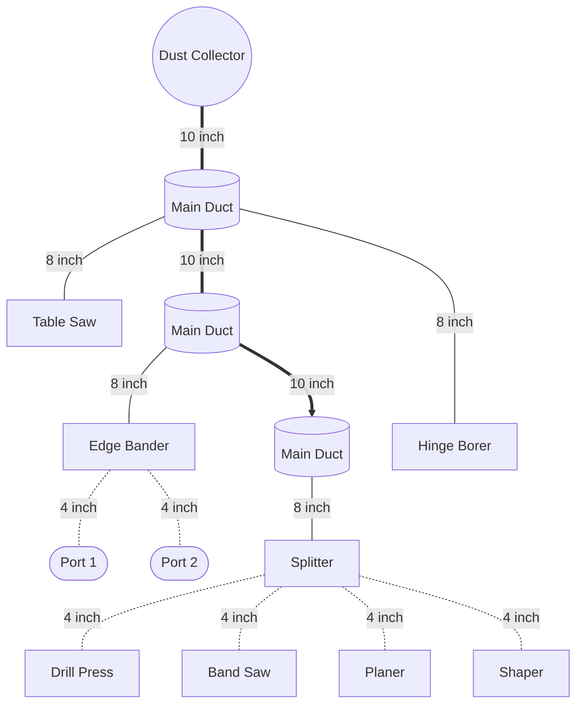
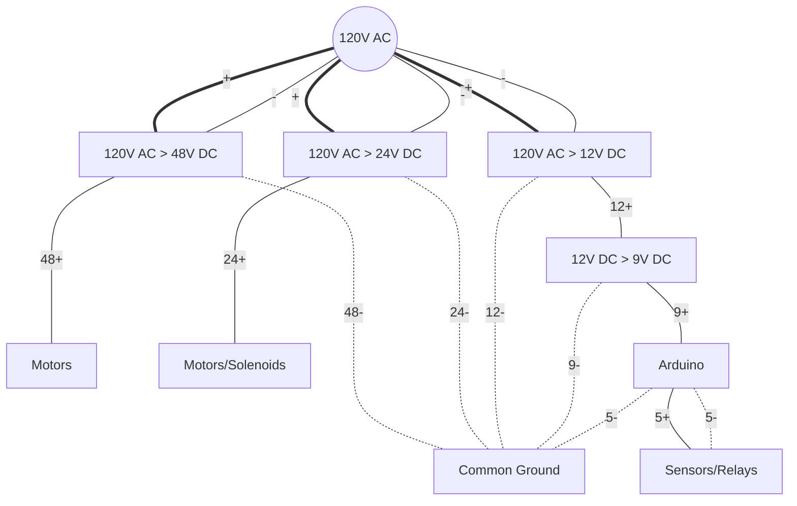

# Dust Fairy
Arduino based Dust Collection system automation with Blast Gates coordination and auto on/off control.

## ABSTRACT (work in progress)

This system with few easy steps will help achieve set-it-and-forget-it automation.
Using just a few commonly found sensors, relays and contactors with other easiely swappable components that make up dust-fairy the system will accomodate from large industrial shop to home hobbyist dust collection system wihtout breaking a buck.

Idea is to use arduino as a brain of the operation with ability to detect activationsignal of certain equipment and keep open corresponding blast gate while closing other blast gates and activating dust collection cyclone system for better performance. Keeping in mind safety features especially for large industrial dust collector system, protecting ductwork with gates always open by default and never all clost at any time. With timer delay and blast gate open cycle to clear ductowk this system will keep ductwork free of dust. With future expansion of sensors for statistical analisys of negative pressure generated in the ductowork for better maintenance of the system. 
Eventually upgrading to sensors for a static discharge and fire prevention/detection system.

This project is for anyone who wishes to have smart and compact system automation without breaking a pennybank and have infinite customization. 

The goal of this project is to completely automate machinery and/or outlets for machinery for dust collection system to kick in and have system flush the ducts to keep it in proper shape. To operate simply turn on your table saw or edgebander and system automatically detect which blast gate to open and which to close for better performance, once machine turned off system will automatically keep dust collector on to clear ductway of remaining dust with all open blast gates and it will keep them open for safety reasons until next signal. This delay also prevets rapid on and off of duct collector ro save the motor.

Components

  
- Electronics
  - Arduino
  - Power Supply Units
  - Relays
  - Solenoid valves
  - OPTO-Isolators
  - Push-in Buttons
  - LEDs
  - LCD Displays
  - 12v Fan
- Sensors
  - Pressure Sensors
  - Temperature Sensor
- Electrical High Voltage (120v)
  - contactors 120v and 240v
  - WAGO connectors
- Pneumatics
  - air solenoid valve 
  - air piston for blast gate
  - pneumatic tubes
- Wiring
  - sprinkler 8/0 cable
  - waterproof 2/1 cable
- Housing
  - Junction box
  - DIN Rail
  - DIN Rail adapters for electronic components

 

Here is an schematic of duct collection system of average shop that has dust collector (DC), table saw (TS), edgebander (EB), hingeborer (HB) and drillpress (DP).

System is composed of the main unit that controls gates and main contactor relay for the dust collection system. 
Main unit has an Arduino with relays and sesor board for hall sensors + possibility to add negative air pressure sensors for dust collection duct work testing. As well as sensor for airpressure sytem if no air pressure detected contactrot will not engage preveting ductwork damage.
Blast gates type auto:
- air controlled. Relay controls solenoids for open and close gates eith pneumatic piston connected to air.
- e-motor controlled. Relay controls stepmotor to open the gate or close appropriate gates.
Blast gates type manal:
- blast gate that has a sensor for open or closed position. Once open manually it will start the dust collection system, with one safety gate always open in order to prevent system collapse one quickly closed.

Safety measures programmed:
- [ ] System should have a 1-2 seconds delay of main collector start in order for it to first open the blast gate and then work.
- [x] System should have always open gates once off. 
- [x] System should have one designated safety gate always open when manual gate is in use, once one manual and one auto gate is in use it can close safety gate. However once manual is closed and auto coincidently gets trigger to close should have a delay of 1 sec to close. However regular shit down procedure is more than enough.
- [ ] System should have negative air pressure sonsors build it for safety to open all gates once clogged and cycle trhough to clear the clog. 
- [ ] System should have high air pressure sensor build in to prevent system turn on if no air pressure present. 
- [ ] System should have sensors on blast gate for open close confirmation. (sensors could be sonic to meaure distance between flap and mount position. 

## Installation

Should be easy to install for a novice. Box should come prewired and with code. IF you are taking on this project you 

Arduino Based cotroller must have
- battery UPS
- inputs to open/close air valve
- inputs to open/close blast gates
- display air pressure (at all times)
- display status of blast gates (at all times)
- display status of equipment (at all times)
- display time vacuum running 
- display countdown when all off
- manual power on
- display time and temp
- display V of the battery

IDEA

install pressure sensors at the end of the vacuum lines to measure negative pressure and confirm gates are locked or open and if the system is running

List of things to acquire:

- oled screens x4 or more
- oled multipier
- volt to current converter 
- current to volt conerter
- security camera wire

App design

- on small screens start counter when gate is open and dust collection running.
- one main screen to display statistic for the whole day (reset at midnight) total dust collection runtime.
- and on the bottom displat total runtime (record it in file to access data after reset)
- record psi and runtime time of start and time off
- display should have green button to manual override

blast gates should open/close in sequence not at the same time to save power supply and electornics.

# List of items used in this project.

| Quantity | Item | Price |
| :------: | :--- | :---: |
| 1| Arduino MEGA v3| $45|
|2|12v Relay Board|$12|
||TOTAL | $100

|Description|Item|Qty|Price|Link|
|---	|---	|:-:	|:-:	|---	|
|Junction Box|QILIPSU Hinged Cover Stainless Steel Latch 410x310x180mm Junction Box with Mounting Plate, Universal IP67 Project Box Waterproof DIY Electrical Enclosure, ABS Plastic Grey (16.1"x12.2"x7.1")|1|$81.99|[Amazon](https://a.co/d/4FpkCln)|
|LCD Displays|SunFounder 2004 20x4 LCD Module IIC I2C Interface Adapter Blue Backlight Compatible with MEGA2560 Arduino R3 Raspberry (2 Pack)|1|$19.99|[Amazon](https://a.co/d/2E2vY0M)|
|5v PSU|MEAN WELL MDR-60-5 AC to DC DIN-Rail Power Supply 5V 10 Amp 50W|1|$28.99|[Amazon](https://a.co/d/33TmTh2)|
|12v PSU|MEAN WELL MDR-60-12 AC to DC DIN-Rail Power Supply 12V 5 Amp 60W|2|$24.00|[Amazon](https://a.co/d/5dQdMeC)|
|24v PSU|MEAN WELL MDR-60-24 DIN-Rail Power Supply 24V 2.5 Amp 60W|1|$22.49|[Amazon](https://a.co/d/6mkE9pu)|
|Buttons|Baomain 16mm Push Button Switch Latching Rectangular Cap LED Lamp Red Yellow Orange Blue Green Light DC 12V SPDT 5 Pin 5 Pack|1|$10.99|[Amazon](https://a.co/d/1EZg6n6)|
|Wiring Harness for Buttons|Baomain Wiring Plug with Harness for 16mm Push Button Switch ON Off 1 NO 1 NC Wire Connectors Pack of 10|1|$11.99|[Amazon](https://a.co/d/dSH3Y6H)|
|OPTO-Isolator|Optical Isolator Module, 24V Voltage Level Current Converter Module 80KHz 1-Channel Optocoupler Photoelectric Optoisolator 12V PNP NPN Signal Converter PC817 Optocoupler Optoisolator|1|$8.99|[Amazon](https://a.co/d/0JrG9DZ)|
|12v Relays|HiLetgo 12V 8 Channel Relay Module with OPTO-Isolated High and Low Level Trigger 8 Ways Relay Switch Module for Arduino|2|$10.89|[Amazon](https://a.co/d/biqa6bW)|
|12v Relay|Relay Module One Way 30A Optocoupler Isolation Relay Module High Power Relay High/Low Level Trigger YYG-2(12VDC)|1|$11.99|[Amazon](https://a.co/d/cq8jZBd)|
|Temp Sensor|Adafruit (PID 3251) Si7021 Temperature & Humidity Sensor Breakout Board|1|$11.91|[Amazon](https://a.co/d/1SLCksJ)|
|Pressure Sensor|1/8NPT Thread Stainless Steel Pressure Transducer Sender Sensor 30/100 /150/200/300/500 psi for Oil Fuel Air Water(300PSI)|2|$12.51|[Amazon](https://a.co/d/c8omCkO)|
|1/4 to 1/8 Adapter|TAISHER 5PCS Forging of 304 Stainless Steel Reducer Hex Bushing, 1/4" Male NPT to 1/8" Female NPT, Reducing Forging Pipe Adapter Fitting|1|$13.99|[Amazon](https://a.co/d/3qONWvD)|
|Sticker|High Voltage Volt Markers Labels for Conduit PVC Pipe Vinyl Stickers  Decals  Electrical 6x|1|$3.90|[Amazon](https://a.co/d/c2rZJgw)|
|   	|   	|   	|   	|[Amazon]()|
|   	|   	|   	|   	|[Amazon]()|
|   	|   	|   	|   	|[Amazon]()|
|   	|   	|   	|   	|[Amazon]()|
|   	|   	|   	|   	|[Amazon]()|
|   	|   	|   	|   	|[Amazon]()|
|   	|   	|   	|   	|[Amazon]()|
|   	|   	|   	|   	|[Amazon]()|
|   	|   	|   	|   	|[Amazon]()|