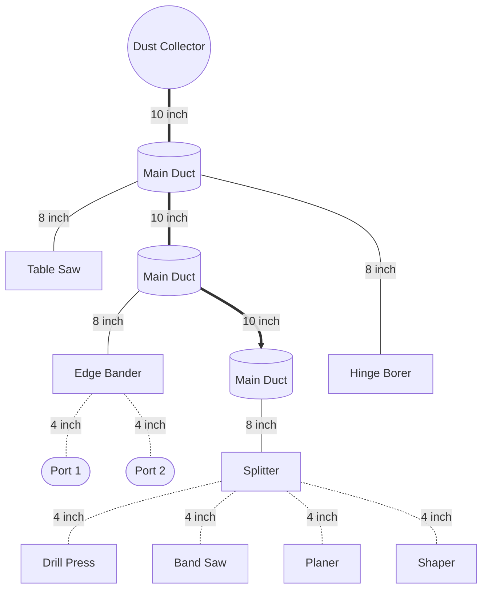

# dust-fairy
Arduino based Dust Collection system automation. Blast gate coordination and auto on/off control

## ABSTRACT

This automation with few easy steps will help achieve set-it-and-forget-it automation.
Few commonly found sensors and contactors that make up dust-fairy easily swappable and able to fit from large industrial shop to home hobbyist dust collection system wihtout breaking a buck. 

Idea is to use arduino as a brain of the operation with ability to detect current flow to a certain duct intake and turn on main dust collector while closing other blast valves for better dust collection performance. Keeping in mind safety features especially for over 5hp industrial collectors, protecting ductwork with one gate always open. With timer delay and blast gate open cycle to clear ductowk. With future expansion of sensors for statistical analisys of negative pressure generated in the ductowork for better maintenance of the system. 
Eventually upgrading to sensors for a static discharge and fire prevention and detection system.

This project is for anyone who wishes to have complate system automation without breaking a pennybank and have customization. Modular design helps streamline process. 

The goal pf this project is to completely automate machinery and/or outlets for machinery for dust collection system to kick in and have system flush the ducts to keep it in proper shape. Just turn on your table saw or edgebander and system automatically detect which blast gate to open and which to close for better performance, once the cut or edgebanding is done system will automatically maintain sucktion to at first clear ductway of remaining dust then open all valves to clear whole system and keep them open for safety reasons until other quupment is turned on. This delay also prevets rapid on and off of duct collector ro save the motor.

Components

  
- arduino
- relays
- contactors 120v and 240v
- step down converters 120 > 48v
- step down converter 48v > 12v
- step down converter 48v > 5v
- air solenoid valve 
- air pistor for blast gate
- hall sensors
- cat5e cable
- thermostat cable
- vacuum tubes

Here is an schematic of duct collection system of average shop that has dust collector (DC), table saw (TS), edgebander (EB), hingeborer (HB) and drillpress (DP).

System is composed of the main unit that controls gates and main contactor relay for the dust collection system. 
Main unit has an Arduino with relays and sesor board for hall sensors + possibility to add negative air pressure sensors for dust collection duct work testing. As well as sensor for airpressure sytem if no air pressure detected contactrot will not engage preveting ductwork damage.
Blast gates type auto:
- air controlled. Relay controls solenoids for open and close gates eith pneumatic piston connected to air.
- e-motor controlled. Relay controls stepmotor to open the gate or close appropriate gates.
Blast gates type manal:
- blast gate that has a sensor for open or closed position. Once open manually it will start the dust collection system, with one safety gate always open in order to prevent system collapse one quickly closed.

Safety measures programmed:
- [ ] System should have a 1-2 seconds delay of main collector start in order for it to first open the blast gate and then work.
- [x] System should have always open gates once off. 
- [x] System should have one designated safety gate always open when manual gate is in use, once one manual and one auto gate is in use it can close safety gate. However once manual is closed and auto coincidently gets trigger to close should have a delay of 1 sec to close. However regular shit down procedure is more than enough.
- [x] System should have negative air pressure sonsors build it for safety to open all gates once clogged and cycle trhough to clear the clog. 
- [ ] System should have high air pressure sensor build in to prevent system turn on if no air pressure present. 
- [ ] System should have sensors on blast gate for open close confirmation. (sensors could be sonic to meaure distance between flap and mount position. 

## Installation

Should be easy to install for a novice. Box should come prewired and with code. 

Arduino Based cotroller must have
- battery UPS
- inputs to open/close air valve
- inputs to open/close blast gates
- display air pressure (at all times)
- display status of blast gates (at all times)
- display status of equipment (at all times)
- display time vacuum running 
- display countdown when all off
- manual power on
- display time and temp
- display V of the battery
