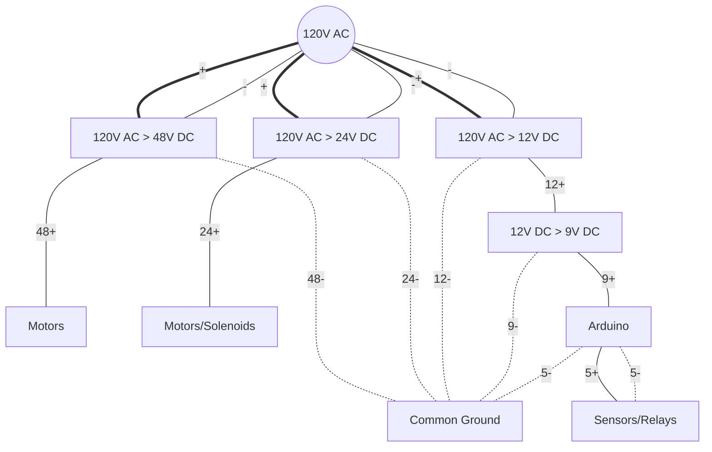

<h1 align="center" style="display: block; font-size: 2.5em; font-weight: bold; margin-block-start: 1em; margin-block-end: 1em;">
   
  
   
    <!--   -->
  <strong>Dust Fairy</strong>
   
</h1>

<h4 align="center">Dust Fairy is an Arduino based Dust Collection system automation with blast gates coordination and auto on/off control.</h4>

  <h4>
  <!-- stars -->
    
    <!-- last commit -->
    
    <!-- commit activity -->
    
    <!-- license -->
    
    <!-- PayPal donate -->
    
  </h4>

<!-- 

  
  
    

  -->

<!--  -->
    

  <a href="#abstract">Abstract</a> •
  <a href="#introduction">Introduction</a> •
  <a href="#idea">Idea</a> •
  <a href="#build-components">Build Components</a> •
  <a href="#how-it-works">How It Works</a> •
  <a href="#build-process">Build Process</a> •
  <a href="#results">Results</a> •
  <a href="#future-improvements">Future Improvements</a> •
  <a href="#license">License</a>

## ABSTRACT 
This system, with a few easy steps, will help achieve set-it-and-forget-it automation. Using just a few commonly found sensors, relays, and contactors with other easily swappable components that make up dust-fairy, the system will accommodate any size setup, from the smallest home-hobbyist garage setup to a large industrial system without breaking a buck.

The idea is to use Arduino as the brain of the operation to detect the activation signal of particular equipment and keep open the corresponding blast gate while closing other blast gates and activating the dust collection system for better performance. 
    
Integrated safety features, especially for large industrial dust collector systems, protect ductwork with gates by defaulting to always open state and never close all blast gates at any time. With dust collection timer delay and blast gate open cycle to clear ductwork, system will keep ductwork free of leftover dust.
    
Future expansion may include sensors for statistical analysis of negative pressure generated in the ductwork for preventative system maintenance and logging static pressure difference in the system.

## INTRODUCTION
Industrial systems of larger sizes are incredibly costly and complicated. Small shop systems are also expensive, very limiting in customization, and are not reliable. Arduino can help in the centralization and infinite customization of the project with readily available inexpensive components. This system is in the sweet spot for anyone wishing to have automation of a dust collection system with multiple workstations in the shop.

This project is for anyone who wishes to have smart and compact system automation without breaking a penny bank and have infinite customization with option of future expansion.

This project aims to completely automate machinery and/or outlets for machinery for the dust collection system to kick in. To operate, turn on your shop equipment, and the system automatically detects which blast gate to open and which to close for better performance. Once the shop equipment is turned off system will automatically keep the dust collector on to clear the ductway of remaining dust with all open blast gates, and it will keep them open for safety reasons by default. The dust collector off delay also prevents rapid on and off of the duct collector to prevent premature motor failure.

## IDEA
DIY inexpensive Arduino-based system controlling relays and solenoids to open and close pneumatic blast gates and turn on and off dust collection system via a contactor. Sensory feedback of the pressurized air system in the shop might be used in logic. The system should be housed neatly in one spot for easy access and troubleshooting.
Pneumatic pistons have higher reliability and with pressure limiting attachements adjust speed of motion, pneumatic pistons are very powerful, easier to mount and virtually any shop have air compressor. Pneumatic pistons are able to operate at pressure as low as 14psi. Compared to servo motors pneumatic pistons have more advantages in this application. 

## BUILD COMPONENTS

Short List

  
- Electronics
  - Arduino Mega
  - Power Supply Units
  - Relays
  - Solenoid valves
  - OPTO-Isolators
  - Push-in Buttons with LED's
  - LCD Displays
  
- Sensors
  - Pressure Sensors
  - Temperature Sensor
- Electrical High Voltage (120v)
  - contactors 120v and 240v
  - WAGO connectors
- Pneumatics
  - air solenoid valve 
  - air piston for blast gate
  - pneumatic tubes
- Wiring
  - sprinkler 18/10 cable
  - waterproof 16/3 cable
- Housing
  - Junction box
  - DIN Rail
  - DIN Rail adapters for electronic components
  - 12v Fan

Comprehensive list with prices

 

|Description|Item|Qty|Price|Link|
|---	|---	|:-:	|:-:	|---	|
|Arduino|Arduino Mega 2560 REV3 [A000067]|1|$43.49|[Amazon](https://a.co/d/97XlDF3)|
|Junction Box|QILIPSU Hinged Cover Stainless Steel Latch 410x310x180mm Junction Box with Mounting Plate, Universal IP67 Project Box Waterproof DIY Electrical Enclosure, ABS Plastic Grey (16.1"x12.2"x7.1")|1|$81.99|[Amazon](https://a.co/d/4FpkCln)|
|LCD Displays|SunFounder 2004 20x4 LCD Module IIC I2C Interface Adapter Blue Backlight Compatible with MEGA2560 Arduino R3 Raspberry (2 Pack)|1|$19.99|[Amazon](https://a.co/d/2E2vY0M)|
|5v PSU|MEAN WELL MDR-60-5 AC to DC DIN-Rail Power Supply 5V 10 Amp 50W|1|$28.99|[Amazon](https://a.co/d/33TmTh2)|
|12v PSU|MEAN WELL MDR-60-12 AC to DC DIN-Rail Power Supply 12V 5 Amp 60W|2|$24.00|[Amazon](https://a.co/d/5dQdMeC)|
|24v PSU|MEAN WELL MDR-60-24 DIN-Rail Power Supply 24V 2.5 Amp 60W|1|$22.49|[Amazon](https://a.co/d/6mkE9pu)|
|Buttons|Baomain 16mm Push Button Switch Latching Rectangular Cap LED Lamp Red Yellow Orange Blue Green Light DC 12V SPDT 5 Pin 5 Pack|1|$10.99|[Amazon](https://a.co/d/1EZg6n6)|
|Wiring Harness for Buttons|Baomain Wiring Plug with Harness for 16mm Push Button Switch ON Off 1 NO 1 NC Wire Connectors Pack of 10|1|$11.99|[Amazon](https://a.co/d/dSH3Y6H)|
|OPTO-Isolator|Optical Isolator Module, 24V Voltage Level Current Converter Module 80KHz 1-Channel Optocoupler Photoelectric Optoisolator 12V PNP NPN Signal Converter PC817 Optocoupler Optoisolator|1|$8.99|[Amazon](https://a.co/d/0JrG9DZ)|
|12v Relays|HiLetgo 12V 8 Channel Relay Module with OPTO-Isolated High and Low Level Trigger 8 Ways Relay Switch Module for Arduino|2|$10.89|[Amazon](https://a.co/d/biqa6bW)|
|12v Relay|Relay Module One Way 30A Optocoupler Isolation Relay Module High Power Relay High/Low Level Trigger YYG-2(12VDC)|1|$11.99|[Amazon](https://a.co/d/cq8jZBd)|
|Temp Sensor|Adafruit (PID 3251) Si7021 Temperature & Humidity Sensor Breakout Board|1|$11.91|[Amazon](https://a.co/d/1SLCksJ)|
|Pressure Sensor|1/8NPT Thread Stainless Steel Pressure Transducer Sender Sensor 30/100 /150/200/300/500 psi for Oil Fuel Air Water(300PSI)|2|$12.51|[Amazon](https://a.co/d/c8omCkO)|
|1/4 to 1/8 Adapter|TAISHER 5PCS Forging of 304 Stainless Steel Reducer Hex Bushing, 1/4" Male NPT to 1/8" Female NPT, Reducing Forging Pipe Adapter Fitting|1|$13.99|[Amazon](https://a.co/d/3qONWvD)|
|Sticker|High Voltage Volt Markers Labels for Conduit PVC Pipe Vinyl Stickers  Decals  Electrical 6x|1|$3.90|[Amazon](https://a.co/d/c2rZJgw)|
|Jumpers for DIN rail|Dinkle DSS2.5N-02P DIN Rail Terminal Block Press-Fit Jumper DK2.5N Two Pole, Pack of 50|1|$28.99|[Amazon](https://a.co/d/gBGoekQ)|
|DIN Rail|Dinkle UL Listed DIN Rail Terminal Block Kit #1 Red/Black Dinkle 20 DK2.5N 12 AWG Gauge 20A 600V Ground DK2.5N-PE Jumper DSS2.5N-10P End Covers End Brackets|1|$28.99|[Amazon](https://a.co/d/6COxiq5)|
|DIN Rail|Dinkle UL Gray DIN Rail Terminal Block Kit 20 DK2.5N 12 AWG Gauge 20A 600V Ground DK4N-PE Jumper DSS2.5N-10P End Covers End Brackets Grey|1|$29.89|[Amazon](https://a.co/d/bvJVWza)|
|Liquidtight connectors for box|AMPELE Cable Gland 100 Pack PG11 Waterproof Adjustable 5-10mm Nylon Cable Glands with Gaskets, Black(PG11)|1|$26.99|[Amazon](https://a.co/d/8jSKCTC)|
|Connectors|WAGO 221 Lever-Nuts 28pc Wire Connector Assortment Pocket Pack|1|$19.95|[Amazon](https://a.co/d/aL7O9Bf)|
|Connectors|WAGO 221 LEVER-NUTS 36pc Compact Splicing Wire Connector Assortment. Includes (16x) 221-412, (12x) 221-413, (8x) 221-415|1|$26.95|[Amazon](https://a.co/d/6gPCtRC)|
|Cable Management|StarTech.com Open Slot Cable Management Raceway with Cover, 2"(50mm) W x 2"(50mm) H - 6.5ft(2m) Length - 1/4"(8mm) Slots, PVC Network Cable Hider/Wall Wire Duct, Max 80 Cables, UL Listed (CBMWD5050)|1|$30.99|[Amazon](https://a.co/d/bzO1nQN)|
|Solenoids|TAILONZ PNEUMATIC Solenoid Valve 4V220-08 DC12V 1/4"NPT Double Coil Pilot-Operated Electric 2 Position 5 Way Connection Type|5|$19.49|[Amazon](https://a.co/d/8L7D5xS)|
|Blue Hose|TAILONZ PNEUMATIC Blue 6mm OD 4mm ID Polyurethane PU Air Hose Pipe Tube Kit 32 Meter 100ft|1|$29.99|[Amazon](https://a.co/d/cMDLKqA)|
|Clear Hose|TAILONZ PNEUMATIC Clear 6mm OD 4mm ID Polyurethane PU Air Hose Pipe Tube Kit 32 Meter 100ft|1|$28.99|[Amazon](https://a.co/d/icABpnR)|
|Piston 32x200|Baomain Pneumatic Air Cylinder SC 32-200 32mm Bore 200mm Stroke Screwed Piston Rod Dual Action|1|$20.99|[Amazon](https://a.co/d/1gbcPcx)|
|Piston 32x125|Baomain Pneumatic Air Cylinder SC 32 x 125 PT 1/8, Bore: 1 1/4 inch, Stroke: 5 inch, Screwed Piston Rod Dual Action 1 Mpa|2|$27.99|[Amazon](https://a.co/d/dKf5bHt)|
|Piston 10x100|TAILONZ PNEUMATIC 10mm Bore 100mm Stroke Double-Rod Double-Acting Aluminum Pneumatic Air Cylinder TN10-100|1|$15.99|[Amazon](https://a.co/d/eMUnzln)|
|Control Valve|Beduan Pneumatic Push to Connect Air Flow Control Valve, 6mm Tube OD x 1/8" Male Thread, Elbow 90 Degree Switch Valve Adapter Fitting ( Pack of 5 )|2|$15.99|[Amazon](https://a.co/d/0dU8rmG)|
|   	|   	|   	|   	|[Amazon]()|
|   	|   	|   	|   	|[Amazon]()|
|   	|   	|   	|   	|[Amazon]()|
|   	|   	|   	|   	|[Amazon]()|
|18/10 wire|By-the-Foot 18/10 Black Solid UL Sprinkler System Wire|10|$1.28|[Home Depot](https://www.homedepot.com/p/Southwire-By-the-Foot-18-10-Black-Solid-UL-Sprinkler-System-Wire-49270299/204724972)|
|16/3 wire|By-the-Foot 16/3 600-Volt CU Black Flexible Portable Power SOOW Cord|13|$1.07|[Home Depot](https://www.homedepot.com/p/Southwire-By-the-Foot-16-3-600-Volt-CU-Black-Flexible-Portable-Power-SOOW-Cord-55810099/204725139)|
 

For a full list of items [link](#list-of-items-used-in-this-project) 

## HOW IT WORKS
System is composed of the Arduino MEGA that controls gates and main contactor via relays.
Main unit has an Arduino with relays and sesor board for hall sensors + possibility to add negative air pressure sensors for dust collection duct work testing. As well as sensor for airpressure sytem if no air pressure detected contactrot will not engage preveting ductwork damage.
Blast gates type auto:
- air controlled. Relay controls solenoids for open and close gates eith pneumatic piston connected to air.
- e-motor controlled. Relay controls stepmotor to open the gate or close appropriate gates.
Blast gates type manal:
- blast gate that has a sensor for open or closed position. Once open manually it will start the dust collection system, with one safety gate always open in order to prevent system collapse one quickly closed.

Safety measures programmed:
- [ ] System should have a 1-2 seconds delay of main collector start in order for it to first open the blast gate and then work.
- [x] System should have always open gates once off. 
- [x] System should have one designated safety gate always open when manual gate is in use, once one manual and one auto gate is in use it can close safety gate. However once manual is closed and auto coincidently gets trigger to close should have a delay of 1 sec to close. However regular shit down procedure is more than enough.
- [ ] System should have negative air pressure sonsors build it for safety to open all gates once clogged and cycle trhough to clear the clog. 
- [ ] System should have high air pressure sensor build in to prevent system turn on if no air pressure present. 
- [ ] System should have sensors on blast gate for open close confirmation. (sensors could be sonic to meaure distance between flap and mount position. 

## BUILD PROCESS
Pictures
## RESULTS
Working video and gifs
## FUTURE IMPROVEMENTS
Maybe some improvements

## LICENSE

MIT

    

JUNK

## EDITING

App design

- on small screens start counter when gate is open and dust collection running.
- one main screen to display statistic for the whole day (reset at midnight) total dust collection runtime.
- and on the bottom displat total runtime (record it in file to access data after reset)
- record psi and runtime time of start and time off
- display should have green button to manual override

blast gates should open/close in sequence not at the same time to save power supply and electornics.

| Quantity | Item | Price |
| :------: | :--- | :---: |
| 1| Arduino MEGA v3| $45|
|2|12v Relay Board|$12|
||TOTAL | $100

Here is an schematic of duct collection system of average shop that has dust collector (DC), table saw (TS), edgebander (EB), hingeborer (HB) and drillpress (DP).

## Installation

Should be easy to install for a novice. Box should come prewired and with code. IF you are taking on this project you 

Arduino Based cotroller must have
- battery UPS
- inputs to open/close air valve
- inputs to open/close blast gates
- display air pressure (at all times)
- display status of blast gates (at all times)
- display status of equipment (at all times)
- display time vacuum running 
- display countdown when all off
- manual power on
- display time and temp
- display V of the battery

## THINGS TO IMPROVE

install pressure sensors at the end of the vacuum lines to measure negative pressure and confirm gates are locked or open and if the system is running

List of things to acquire:

- oled screens x4 or more
- oled multipier
- fire sensors
- dust bin sensor
- negative pressure sensor
  

# List of items used in this project.

|Description|Item|Qty|Price|Link|
|---	|---	|:-:	|:-:	|---	|
|Arduino|Arduino Mega 2560 REV3 [A000067]|1|$43.49|[Amazon](https://a.co/d/97XlDF3)|
|Junction Box|QILIPSU Hinged Cover Stainless Steel Latch 410x310x180mm Junction Box with Mounting Plate, Universal IP67 Project Box Waterproof DIY Electrical Enclosure, ABS Plastic Grey (16.1"x12.2"x7.1")|1|$81.99|[Amazon](https://a.co/d/4FpkCln)|
|LCD Displays|SunFounder 2004 20x4 LCD Module IIC I2C Interface Adapter Blue Backlight Compatible with MEGA2560 Arduino R3 Raspberry (2 Pack)|1|$19.99|[Amazon](https://a.co/d/2E2vY0M)|
|5v PSU|MEAN WELL MDR-60-5 AC to DC DIN-Rail Power Supply 5V 10 Amp 50W|1|$28.99|[Amazon](https://a.co/d/33TmTh2)|
|12v PSU|MEAN WELL MDR-60-12 AC to DC DIN-Rail Power Supply 12V 5 Amp 60W|2|$24.00|[Amazon](https://a.co/d/5dQdMeC)|
|24v PSU|MEAN WELL MDR-60-24 DIN-Rail Power Supply 24V 2.5 Amp 60W|1|$22.49|[Amazon](https://a.co/d/6mkE9pu)|
|Buttons|Baomain 16mm Push Button Switch Latching Rectangular Cap LED Lamp Red Yellow Orange Blue Green Light DC 12V SPDT 5 Pin 5 Pack|1|$10.99|[Amazon](https://a.co/d/1EZg6n6)|
|Wiring Harness for Buttons|Baomain Wiring Plug with Harness for 16mm Push Button Switch ON Off 1 NO 1 NC Wire Connectors Pack of 10|1|$11.99|[Amazon](https://a.co/d/dSH3Y6H)|
|OPTO-Isolator|Optical Isolator Module, 24V Voltage Level Current Converter Module 80KHz 1-Channel Optocoupler Photoelectric Optoisolator 12V PNP NPN Signal Converter PC817 Optocoupler Optoisolator|1|$8.99|[Amazon](https://a.co/d/0JrG9DZ)|
|12v Relays|HiLetgo 12V 8 Channel Relay Module with OPTO-Isolated High and Low Level Trigger 8 Ways Relay Switch Module for Arduino|2|$10.89|[Amazon](https://a.co/d/biqa6bW)|
|12v Relay|Relay Module One Way 30A Optocoupler Isolation Relay Module High Power Relay High/Low Level Trigger YYG-2(12VDC)|1|$11.99|[Amazon](https://a.co/d/cq8jZBd)|
|Temp Sensor|Adafruit (PID 3251) Si7021 Temperature & Humidity Sensor Breakout Board|1|$11.91|[Amazon](https://a.co/d/1SLCksJ)|
|Pressure Sensor|1/8NPT Thread Stainless Steel Pressure Transducer Sender Sensor 30/100 /150/200/300/500 psi for Oil Fuel Air Water(300PSI)|2|$12.51|[Amazon](https://a.co/d/c8omCkO)|
|1/4 to 1/8 Adapter|TAISHER 5PCS Forging of 304 Stainless Steel Reducer Hex Bushing, 1/4" Male NPT to 1/8" Female NPT, Reducing Forging Pipe Adapter Fitting|1|$13.99|[Amazon](https://a.co/d/3qONWvD)|
|Sticker|High Voltage Volt Markers Labels for Conduit PVC Pipe Vinyl Stickers  Decals  Electrical 6x|1|$3.90|[Amazon](https://a.co/d/c2rZJgw)|
|Jumpers for DIN rail|Dinkle DSS2.5N-02P DIN Rail Terminal Block Press-Fit Jumper DK2.5N Two Pole, Pack of 50|1|$28.99|[Amazon](https://a.co/d/gBGoekQ)|
|DIN Rail|Dinkle UL Listed DIN Rail Terminal Block Kit #1 Red/Black Dinkle 20 DK2.5N 12 AWG Gauge 20A 600V Ground DK2.5N-PE Jumper DSS2.5N-10P End Covers End Brackets|1|$28.99|[Amazon](https://a.co/d/6COxiq5)|
|DIN Rail|Dinkle UL Gray DIN Rail Terminal Block Kit 20 DK2.5N 12 AWG Gauge 20A 600V Ground DK4N-PE Jumper DSS2.5N-10P End Covers End Brackets Grey|1|$29.89|[Amazon](https://a.co/d/bvJVWza)|
|Liquidtight connectors for box|AMPELE Cable Gland 100 Pack PG11 Waterproof Adjustable 5-10mm Nylon Cable Glands with Gaskets, Black(PG11)|1|$26.99|[Amazon](https://a.co/d/8jSKCTC)|
|Connectors|WAGO 221 Lever-Nuts 28pc Wire Connector Assortment Pocket Pack|1|$19.95|[Amazon](https://a.co/d/aL7O9Bf)|
|Connectors|WAGO 221 LEVER-NUTS 36pc Compact Splicing Wire Connector Assortment. Includes (16x) 221-412, (12x) 221-413, (8x) 221-415|1|$26.95|[Amazon](https://a.co/d/6gPCtRC)|
|Cable Management|StarTech.com Open Slot Cable Management Raceway with Cover, 2"(50mm) W x 2"(50mm) H - 6.5ft(2m) Length - 1/4"(8mm) Slots, PVC Network Cable Hider/Wall Wire Duct, Max 80 Cables, UL Listed (CBMWD5050)|1|$30.99|[Amazon](https://a.co/d/bzO1nQN)|
|Solenoids|TAILONZ PNEUMATIC Solenoid Valve 4V220-08 DC12V 1/4"NPT Double Coil Pilot-Operated Electric 2 Position 5 Way Connection Type|5|$19.49|[Amazon](https://a.co/d/8L7D5xS)|
|Blue Hose|TAILONZ PNEUMATIC Blue 6mm OD 4mm ID Polyurethane PU Air Hose Pipe Tube Kit 32 Meter 100ft|1|$29.99|[Amazon](https://a.co/d/cMDLKqA)|
|Clear Hose|TAILONZ PNEUMATIC Clear 6mm OD 4mm ID Polyurethane PU Air Hose Pipe Tube Kit 32 Meter 100ft|1|$28.99|[Amazon](https://a.co/d/icABpnR)|
|Piston 32x200|Baomain Pneumatic Air Cylinder SC 32-200 32mm Bore 200mm Stroke Screwed Piston Rod Dual Action|1|$20.99|[Amazon](https://a.co/d/1gbcPcx)|
|Piston 32x125|Baomain Pneumatic Air Cylinder SC 32 x 125 PT 1/8, Bore: 1 1/4 inch, Stroke: 5 inch, Screwed Piston Rod Dual Action 1 Mpa|2|$27.99|[Amazon](https://a.co/d/dKf5bHt)|
|Piston 10x100|TAILONZ PNEUMATIC 10mm Bore 100mm Stroke Double-Rod Double-Acting Aluminum Pneumatic Air Cylinder TN10-100|1|$15.99|[Amazon](https://a.co/d/eMUnzln)|
|Control Valve|Beduan Pneumatic Push to Connect Air Flow Control Valve, 6mm Tube OD x 1/8" Male Thread, Elbow 90 Degree Switch Valve Adapter Fitting ( Pack of 5 )|2|$15.99|[Amazon](https://a.co/d/0dU8rmG)|
|   	|   	|   	|   	|[Amazon]()|
|   	|   	|   	|   	|[Amazon]()|
|   	|   	|   	|   	|[Amazon]()|
|   	|   	|   	|   	|[Amazon]()|
|18/8 wire|18/8 Brown Solid CU CL2 Thermostat Wire|10|$0.98|[Home Depot](https://www.homedepot.com/p/Southwire-250-ft-18-8-Brown-Solid-CU-CL2-Thermostat-Wire-65676944/202316421)|
|16/3 wire|By-the-Foot 16/3 600-Volt CU Black Flexible Portable Power SOOW Cord|13|$1.07|[Home Depot](https://www.homedepot.com/p/Southwire-By-the-Foot-16-3-600-Volt-CU-Black-Flexible-Portable-Power-SOOW-Cord-55810099/204725139)|