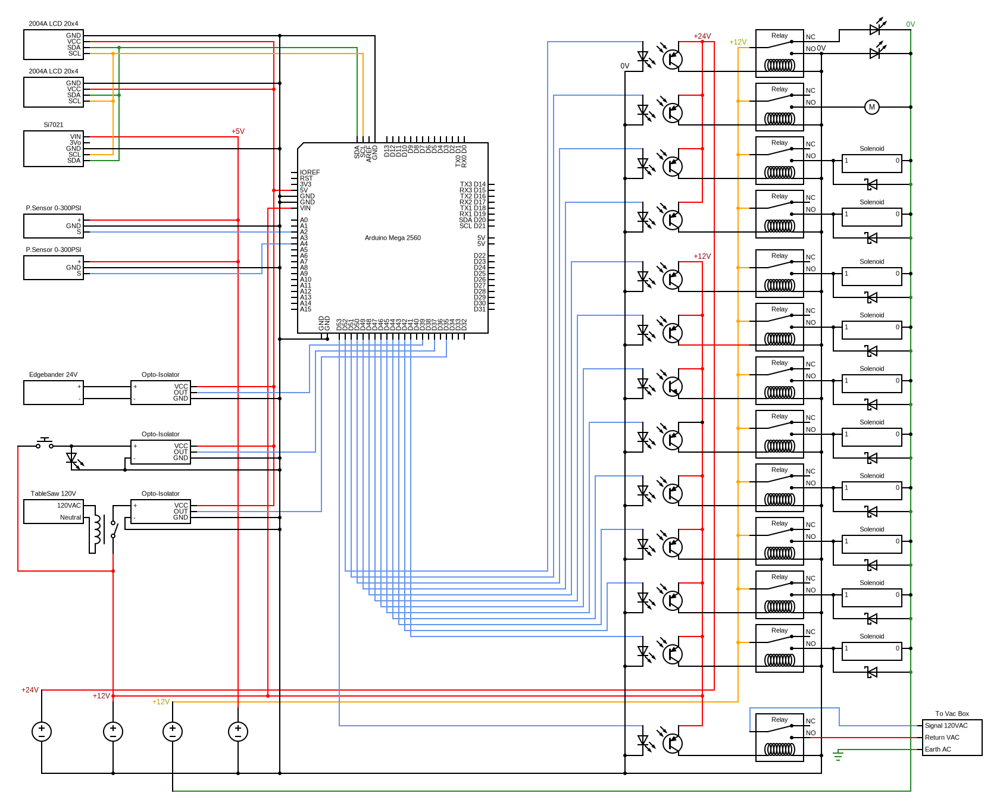

<h1 align="center" style="display: block; font-size: 2.5em; font-weight: bold; margin-block-start: 1em; margin-block-end: 1em;">
   
  
   
    <!--   -->
  <strong>Dust Fairy</strong>
   
</h1>

<h4 align="center">Dust Fairy is an Arduino based Dust Collection system automation with blast gates coordination and auto on/off control.</h4>

  <h4>
  <!-- stars -->
    
    <!-- last commit -->
    
    <!-- commit activity -->
    
    <!-- license -->
    <!--  -->
    
    <!-- PayPal donate -->
    
  </h4>

<!--  -->

<!-- 

  
  
    

  -->

<!--  -->
    

  <a href="#abstract">Abstract</a> •
  <a href="#introduction">Introduction</a> •
  <a href="#idea">Idea</a> •
  <a href="#build-components">Components</a> •
  <a href="#how-it-works">How It Works</a> •
  <a href="#build-process">Build Process</a> •
  <a href="#results">Results</a> •
  <a href="#future-improvements">Future Improvements</a> 
  <!-- •
  <a href="#license">License</a> -->

## ABSTRACT 
Multifunctional system design to help achieve set-it-and-forget-it automation. Using just a few commonly found sensors, relays, and contactors with other easily swappable components that make up dust-fairy, the system will accommodate any size setup, from the smallest home-hobbyist garage setup to a large industrial system without breaking a buck.

<!-- The idea is to use Arduino as the brain of the operation to detect the activation signal of particular equipment and keep the corresponding blast gate open while closing non-active blast gates, simultaneously activating the dust collection system for better performance.

Integrated safety features, especially for large industrial dust collector systems, protect ductwork with gates by defaulting to always-open-state and never closing all blast gates at any time. With a dust collection timer delay and blast gate open cycle to clear ductwork, the system will keep ductwork free of leftover dust.

Future expansion may include sensors for statistical analysis of negative pressure generated in the ductwork and preventative system maintenance by logging static pressure differences in the system. -->

## INTRODUCTION
Industrial systems of larger sizes are incredibly costly and complicated, while small shop systems are expensive, very limiting in customization, and not reliable in the long term. The use of an Arduino-based system can help in centralizing and infinitely customizing the project with inexpensive readily available components, such as commonly found sensors, relays, and contactors. 

This project aims to provide a solution for anyone who wishes to have smart and compact dust collection system automation with multiple workstations in a shop without breaking the bank and with virtually infinite customization with the code and the option of future expansion.
<!-- 
Industrial systems of larger sizes are incredibly costly and complicated. Small shop systems are also expensive, very limiting in customization, and are not reliable in the long term. Arduino can help in the centralization and infinite customization of the project with readily available inexpensive components.

This project is for anyone who wishes to have smart and compact dust collection system automation with multiple workstations in the shop without breaking a penny bank and have virtually infinite customization with the code and option of future expansion. -->

<!-- The project aims to completely automate machinery and/or outlets for machinery for the dust collection system to kick in. To operate, turn on your shop equipment, and the system automatically detects which blast gate to open and which to close for better performance. Once the shop equipment is turned off system will automatically keep the dust collector on to clear the ductway of remaining dust with all open blast gates, and it will keep them open for safety reasons by default. The dust collector off delay also prevents rapid on and off of the duct collector to prevent premature motor failure. -->

## IDEA
DIY inexpensive Arduino-based system controlling relays and solenoids to open and close pneumatic blast gates and turn on and off dust collection system via a contactor. The system should be housed neatly in one spot for easy access and troubleshooting. 
Pneumatic pistons have higher reliability and, with pressure-limiting attachments, adjust the speed of motion. Pneumatic pistons are very powerful and easier to mount, and virtually any shop has an air compressor. Pneumatic pistons can operate at pressure as low as 14psi. Compared to servo motors, pneumatic pistons have more advantages in this application.

Original design included split core current transformers by YHDC SCT013, however in my case it was not needed, I opted out with direct connection via OPTO-Isolator and contacor. If anyone interested I can provide code for YHDC SCT013 fine tuned.

## BUILD COMPONENTS

Short General List (click to open)

  
- Electronics
  - Arduino Mega
  - Power Supply Units
  - Relays
  - Solenoid valves
  - OPTO-Isolators
  - Push-in Buttons with LED's
  - LCD Displays
- Sensors
  - pressure sensors
  - temperature sensor
- Electrical High Voltage (120v)
  - contactors 120v and 240v
  - WAGO connectors
- Pneumatics
  - air solenoid valve 
  - air piston for blast gate
  - pneumatic tubes
- Wiring
  - sprinkler 18/10 wire
  - waterproof 16/3 wire
- Housing
  - junction box
  - DIN rail
  - DIN rail adapters for electronic components
  - 12v fan

Comprehensive list with items used in this project including prices and links (click to open)

 

|Description|Item|Qty|Price|Link|
|---	|---	|:-:	|:-:	|---	|
|Arduino|Arduino Mega 2560 REV3 [A000067]|1|$43.49|[Amazon](https://a.co/d/97XlDF3)|
|Junction Box|QILIPSU Hinged Cover Stainless Steel Latch 410x310x180mm Junction Box with Mounting Plate, Universal IP67 Project Box Waterproof DIY Electrical Enclosure, ABS Plastic Grey (16.1"x12.2"x7.1")|1|$81.99|[Amazon](https://a.co/d/4FpkCln)|
|LCD Displays|SunFounder 2004 20x4 LCD Module IIC I2C Interface Adapter Blue Backlight Compatible with MEGA2560 Arduino R3 Raspberry (2 Pack)|1|$19.99|[Amazon](https://a.co/d/2E2vY0M)|
|5v PSU|MEAN WELL MDR-60-5 AC to DC DIN-Rail Power Supply 5V 10 Amp 50W|1|$28.99|[Amazon](https://a.co/d/33TmTh2)|
|12v PSU|MEAN WELL MDR-60-12 AC to DC DIN-Rail Power Supply 12V 5 Amp 60W|2|$24.00|[Amazon](https://a.co/d/5dQdMeC)|
|24v PSU|MEAN WELL MDR-60-24 DIN-Rail Power Supply 24V 2.5 Amp 60W|1|$22.49|[Amazon](https://a.co/d/6mkE9pu)|
|Buttons|Baomain 16mm Push Button Switch Latching Rectangular Cap LED Lamp Red Yellow Orange Blue Green Light DC 12V SPDT 5 Pin 5 Pack|1|$10.99|[Amazon](https://a.co/d/1EZg6n6)|
|Wiring Harness for Buttons|Baomain Wiring Plug with Harness for 16mm Push Button Switch ON Off 1 NO 1 NC Wire Connectors Pack of 10|1|$11.99|[Amazon](https://a.co/d/dSH3Y6H)|
|OPTO-Isolator|Optical Isolator Module, 24V Voltage Level Current Converter Module 80KHz 1-Channel Optocoupler Photoelectric Optoisolator 12V PNP NPN Signal Converter PC817 Optocoupler Optoisolator|1|$8.99|[Amazon](https://a.co/d/0JrG9DZ)|
|12v Relays|HiLetgo 12V 8 Channel Relay Module with OPTO-Isolated High and Low Level Trigger 8 Ways Relay Switch Module for Arduino|2|$10.89|[Amazon](https://a.co/d/biqa6bW)|
|12v Relay|Relay Module One Way 30A Optocoupler Isolation Relay Module High Power Relay High/Low Level Trigger YYG-2(12VDC)|1|$11.99|[Amazon](https://a.co/d/cq8jZBd)|
|Temp Sensor|Adafruit (PID 3251) Si7021 Temperature & Humidity Sensor Breakout Board|1|$11.91|[Amazon](https://a.co/d/1SLCksJ)|
|Pressure Sensor|1/8NPT Thread Stainless Steel Pressure Transducer Sender Sensor 30/100 /150/200/300/500 psi for Oil Fuel Air Water(300PSI)|2|$12.51|[Amazon](https://a.co/d/c8omCkO)|
|1/4 to 1/8 Adapter|TAISHER 5PCS Forging of 304 Stainless Steel Reducer Hex Bushing, 1/4" Male NPT to 1/8" Female NPT, Reducing Forging Pipe Adapter Fitting|1|$13.99|[Amazon](https://a.co/d/3qONWvD)|
|Sticker|High Voltage Volt Markers Labels for Conduit PVC Pipe Vinyl Stickers  Decals  Electrical 6x|1|$3.90|[Amazon](https://a.co/d/c2rZJgw)|
|Jumpers for DIN rail|Dinkle DSS2.5N-02P DIN Rail Terminal Block Press-Fit Jumper DK2.5N Two Pole, Pack of 50|1|$28.99|[Amazon](https://a.co/d/gBGoekQ)|
|DIN Rail|Dinkle UL Listed DIN Rail Terminal Block Kit #1 Red/Black Dinkle 20 DK2.5N 12 AWG Gauge 20A 600V Ground DK2.5N-PE Jumper DSS2.5N-10P End Covers End Brackets|1|$28.99|[Amazon](https://a.co/d/6COxiq5)|
|DIN Rail|Dinkle UL Gray DIN Rail Terminal Block Kit 20 DK2.5N 12 AWG Gauge 20A 600V Ground DK4N-PE Jumper DSS2.5N-10P End Covers End Brackets Grey|1|$29.89|[Amazon](https://a.co/d/bvJVWza)|
|Liquidtight connectors for box|AMPELE Cable Gland 100 Pack PG11 Waterproof Adjustable 5-10mm Nylon Cable Glands with Gaskets, Black(PG11)|1|$26.99|[Amazon](https://a.co/d/8jSKCTC)|
|Connectors|WAGO 221 Lever-Nuts 28pc Wire Connector Assortment Pocket Pack|1|$19.95|[Amazon](https://a.co/d/aL7O9Bf)|
|Connectors|WAGO 221 LEVER-NUTS 36pc Compact Splicing Wire Connector Assortment. Includes (16x) 221-412, (12x) 221-413, (8x) 221-415|1|$26.95|[Amazon](https://a.co/d/6gPCtRC)|
|Cable Management|StarTech.com Open Slot Cable Management Raceway with Cover, 2"(50mm) W x 2"(50mm) H - 6.5ft(2m) Length - 1/4"(8mm) Slots, PVC Network Cable Hider/Wall Wire Duct, Max 80 Cables, UL Listed (CBMWD5050)|1|$30.99|[Amazon](https://a.co/d/bzO1nQN)|
|Solenoids|TAILONZ PNEUMATIC Solenoid Valve 4V220-08 DC12V 1/4"NPT Double Coil Pilot-Operated Electric 2 Position 5 Way Connection Type|5|$19.49|[Amazon](https://a.co/d/8L7D5xS)|
|Blue Hose|TAILONZ PNEUMATIC Blue 6mm OD 4mm ID Polyurethane PU Air Hose Pipe Tube Kit 32 Meter 100ft|1|$29.99|[Amazon](https://a.co/d/cMDLKqA)|
|Clear Hose|TAILONZ PNEUMATIC Clear 6mm OD 4mm ID Polyurethane PU Air Hose Pipe Tube Kit 32 Meter 100ft|1|$28.99|[Amazon](https://a.co/d/icABpnR)|
|Piston 32x200|Baomain Pneumatic Air Cylinder SC 32-200 32mm Bore 200mm Stroke Screwed Piston Rod Dual Action|1|$20.99|[Amazon](https://a.co/d/1gbcPcx)|
|Piston 32x125|Baomain Pneumatic Air Cylinder SC 32 x 125 PT 1/8, Bore: 1 1/4 inch, Stroke: 5 inch, Screwed Piston Rod Dual Action 1 Mpa|2|$27.99|[Amazon](https://a.co/d/dKf5bHt)|
|Piston 10x100|TAILONZ PNEUMATIC 10mm Bore 100mm Stroke Double-Rod Double-Acting Aluminum Pneumatic Air Cylinder TN10-100|1|$15.99|[Amazon](https://a.co/d/eMUnzln)|
|Control Valve|Beduan Pneumatic Push to Connect Air Flow Control Valve, 6mm Tube OD x 1/8" Male Thread, Elbow 90 Degree Switch Valve Adapter Fitting ( Pack of 5 )|2|$15.99|[Amazon](https://a.co/d/0dU8rmG)|
|18/10 wire|By-the-Foot 18/10 Black Solid UL Sprinkler System Wire|10|$1.28|[Home Depot](https://www.homedepot.com/p/Southwire-By-the-Foot-18-10-Black-Solid-UL-Sprinkler-System-Wire-49270299/204724972)|
|16/3 wire|By-the-Foot 16/3 600-Volt CU Black Flexible Portable Power SOOW Cord|13|$1.07|[Home Depot](https://www.homedepot.com/p/Southwire-By-the-Foot-16-3-600-Volt-CU-Black-Flexible-Portable-Power-SOOW-Cord-55810099/204725139)|

<!-- |   	|   	|   	|   	|[Amazon]()|
|   	|   	|   	|   	|[Amazon]()|
|   	|   	|   	|   	|[Amazon]()|
|   	|   	|   	|   	|[Amazon]()| -->

 

<!--   -->

<!--  v1 
For a full list of items [link](#list-of-items-used-in-this-project)
 v2 
For a full list of items [:page_facing_up:](#list-of-items-used-in-this-project) 

:page_facing_up: -->

### Schematic diagrams:
<!-- does not work with mobile GitHub app on iPhone -->
<!-- <picture>
  <source media="(prefers-color-scheme: dark)" srcset="./schematic/ArduinoBoxDiagram/circuit_dark.svg">
  <source media="(prefers-color-scheme: light)" srcset="./schematic/ArduinoBoxDiagram/circuit_light.svg">
  
</picture>

<picture>
  <source media="(prefers-color-scheme: dark)" srcset="./schematic/VacBoxDiagram/circuit_dark.svg">
  <source media="(prefers-color-scheme: light)" srcset="./schematic/VacBoxDiagram/circuit_light.svg">
  
</picture> -->
Schematic diagram of Arduino junction box: 

> 💡 Relay #51 bottom-right has wires heading to dust collection junction box. 

<!--  -->
<!--  -->
Schematic diagram of dust collection junction box(relay#51 is located in Arduino junction box): 

> 💡 Relay #51 top-left is located in Arduino junction box. 

<!--  -->
<!--  -->

## HOW IT WORKS

The system is composed of the Arduino MEGA that controls gates and the main contactor via relays. Arduino collects information from pressure sensors of the main pipeworks and solenoid plate, temperature, and humidity from the primary electronics box temp sensor. High and low from OPTO-ISOLATORS connected to 12v buttons and 24v solenoid in the Edgebander electronics. Arduino controls a set of OPTO-ISOLATED relays, which regulate air solenoids and 120v contactors, LED lights, and a 12v cooling fan for the electronics housing.

Blast gates type auto:
- Air controlled. Relay controls solenoids for open and close gates via a pneumatic piston connected to a compressed air system

Safety measures programmed:
- [x] Ten seconds off delay of the dust collection system with all gates open.
- [x] Always open gates once off.
- [x] One designated safety gate always triggers open when the manual button is activated without other equipment running.
- [x] The system will not open any additional gates if the manual button is pressed while other pieces of equipment are running.
- [x] High air pressure sensor built in to monitor and display warning message with air pressure below programmed value.

- [ ] The system should have negative air pressure sensors built for safety to open all gates once clogged and cycle through to clear the clog.
- [ ] The system should have sensors on the blast gate for open-close confirmation. (could be sonic or metal detect).

## BUILD PROCESS
<!-- Pictures here UPLOADING... -->

Junction box arrived with plastic panels concaved. Great to know that it is airtight, however it was impossible to open without first drilling a hole in it. Then it took some time heating the panels and straighten them out.

With DIN rails arranged it was easy to place and organize components. I used 18/10 wire to color code different voltage power supplies. Wire is a solid cooper and easy to shape. However I wish I had bigger size box to separate each layer with plastic cable organizer. My setup worked for me well. 

Power supply color coded as follows:
|Color|Voltage|Ground|
|:-|:-:|:-|
|Orange|24 v|common|
|Brown|12 v|common|
|Yellow|12 v|isolated|
|White| 5 v|common|

### Power supplies wiring in

Box wiring in with 18/10 wire (wire is easy to mold with colors organizaiton) 

Relays wiring, code test 
 

Relays before and testing after: 

  
  

LCD and temp sensor testing and wiring in 

Measurement and marking for LCD's and latching buttons placement on the front door panel 

Cutting out the holes for LCD. 

> 💡 In the video above pay attention to the LCD in the bottom left corner of the frame, it fell on the floor, however it survived. It took me more filing and fitting than cutting out the holes.

<!-- Wiring in box cover  -->
<!--  -->

Drilling for liquidtight solenoid connectors 

Box mounted, last step before wiring lines to shop equipment 

Of course, labeling of every single wire and relay 
<!--  -->

Attaching wires through liquidtight connection with flyback diodes to connect solenoids with relays. This part has separate isolated PSU, in case flyback diodes are not enought. In my previous tests engaging more than 3 solenoids at once with flayback diodes still casued arduino to restart. Hence separate PSU with extra precautions and ground connection. 

Voila! Box is wired in and connected to the equipment. Of course, labeling is important, kids. 

### Blast Gate Assembly

Commonly found blast gates are used with some finesse and aluminum 1" angle from Home Depot worthy to compete in national blast gate beauty show.

Fitting the cylinder with woodedn support before cutting aluminum angles. 

Blast gate while attaching aluminum anlges for pneumatic cylinder support. 

Fine-tune adjustment of assembled 8" blast gate for smooth operation before installing into a ductwork 

8" blast gate pictured on the left and 4" blast gate on the right, assembled and fitted into the ductwork. 

5" blast gate assembled and fitted into the ductwork 

Another 5" blast gate fitted 

Main air has air pressure directly connected to the air compressor, it fluctuates between 125 psi and 160 psi, however solenoid base air pressure is regulated to approximately 60 psi. These cylinders can operate at as low as 20 psi.

### LCD info display

<!--  -->

## RESULTS

Quick pan of the edgebander side of the system completed, 8", 4" and 5" blast gates shown. All blast gates connected and labeled. 

## FUTURE IMPROVEMENTS

|System Advantages|System Limitations|
|---|---|
|Pneumatuic Cylinder|Air supply line limitation|
|Arduino MEGA|No Wifi or bluetooth module|
|||
 

Do you like the project, have new ideas or suggestions? Please 

<!-- *VS*
 
 
* System Advantages
  * Pneumatic Cylinders
  * Arduino Mega is very robust and customizeable
* System Limitations
  * Air supply line extension
  * No WiFi or Bluetooth connectivity, require additional module -->

## LICENSE

<!-- [MIT](https://github.com/aleksey00/dust-fairy/blob/feature-cleanup/LICENSE) -->
 

    

 

 Table of content:

-  <a href="#">Logo</a>
-  <a href="#abstract">Abstract</a> 
-  <a href="#introduction">Introduction</a> 
-  <a href="#idea">Idea</a> 
-  <a href="#build-components">Components</a> 
-  <a href="#schematic-diagrams">Schematic Diagrams</a> 
-  <a href="#how-it-works">How It Works</a> 
-  <a href="#build-process">Build Process</a> 
   - <a href="#power-supplies-wiring-in">Power supplies wiring in</a>
   - <a href="#blast-gate-assembly">Blast Gate assembly</a>
   - <a href="#LCD-info-display">LCD info</a>
-  <a href="#results">Results</a> 
-  <a href="#future-improvements">Future Improvements</a> 
-  <a href="#license">License</a>

<!--  -->
<!--  -->

<!-- [![forthebadge](data:image/svg+xml;base64,PHN2ZyB4bWxucz0iaHR0cDovL3d3dy53My5vcmcvMjAwMC9zdmciIHdpZHRoPSIxNDEuNDEiIGhlaWdodD0iMzUiIHZpZXdCb3g9IjAgMCAxNDEuNDEgMzUiPjxyZWN0IGNsYXNzPSJzdmdfX3JlY3QiIHg9IjAiIHk9IjAiIHdpZHRoPSI2NS42OCIgaGVpZ2h0PSIzNSIgZmlsbD0iIzMxQzRGMyIvPjxyZWN0IGNsYXNzPSJzdmdfX3JlY3QiIHg9IjYzLjY4IiB5PSIwIiB3aWR0aD0iNzcuNzI5OTk5OTk5OTk5OTkiIGhlaWdodD0iMzUiIGZpbGw9IiMzODlBRDUiLz48cGF0aCBjbGFzcz0ic3ZnX190ZXh0IiBkPSJNMTYuNjcgMjJMMTQuMjIgMjJMMTQuMjIgMTMuNDdMMTYuNzQgMTMuNDdRMTcuODcgMTMuNDcgMTguNzQgMTMuOTdRMTkuNjIgMTQuNDggMjAuMTAgMTUuNDBRMjAuNTggMTYuMzMgMjAuNTggMTcuNTJMMjAuNTggMTcuNTJMMjAuNTggMTcuOTVRMjAuNTggMTkuMTYgMjAuMTAgMjAuMDhRMTkuNjEgMjEuMDAgMTguNzIgMjEuNTBRMTcuODMgMjIgMTYuNjcgMjJMMTYuNjcgMjJaTTE1LjcwIDE0LjY2TDE1LjcwIDIwLjgyTDE2LjY3IDIwLjgyUTE3LjgzIDIwLjgyIDE4LjQ2IDIwLjA5UTE5LjA4IDE5LjM2IDE5LjA5IDE3Ljk5TDE5LjA5IDE3Ljk5TDE5LjA5IDE3LjUyUTE5LjA5IDE2LjEzIDE4LjQ5IDE1LjQwUTE3Ljg5IDE0LjY2IDE2Ljc0IDE0LjY2TDE2Ljc0IDE0LjY2TDE1LjcwIDE0LjY2Wk0yNC45MSAxOS4xNkwyNC45MSAxOS4xNkwyNC45MSAxMy40N0wyNi4zOSAxMy40N0wyNi4zOSAxOS4xOFEyNi4zOSAyMC4wMyAyNi44MiAyMC40OFEyNy4yNSAyMC45MyAyOC4xMCAyMC45M0wyOC4xMCAyMC45M1EyOS44MSAyMC45MyAyOS44MSAxOS4xM0wyOS44MSAxOS4xM0wyOS44MSAxMy40N0wzMS4yOSAxMy40N0wzMS4yOSAxOS4xN1EzMS4yOSAyMC41MyAzMC40MiAyMS4zMlEyOS41NSAyMi4xMiAyOC4xMCAyMi4xMkwyOC4xMCAyMi4xMlEyNi42MyAyMi4xMiAyNS43NyAyMS4zM1EyNC45MSAyMC41NSAyNC45MSAxOS4xNlpNMzUuNDIgMTkuNDJMMzUuNDIgMTkuNDJMMzYuOTAgMTkuNDJRMzYuOTAgMjAuMTUgMzcuMzkgMjAuNTVRMzcuODcgMjAuOTUgMzguNzYgMjAuOTVMMzguNzYgMjAuOTVRMzkuNTQgMjAuOTUgMzkuOTMgMjAuNjNRNDAuMzEgMjAuMzIgNDAuMzEgMTkuODBMNDAuMzEgMTkuODBRNDAuMzEgMTkuMjQgMzkuOTIgMTguOTRRMzkuNTIgMTguNjMgMzguNDkgMTguMzJRMzcuNDYgMTguMDEgMzYuODUgMTcuNjNMMzYuODUgMTcuNjNRMzUuNjkgMTYuOTAgMzUuNjkgMTUuNzJMMzUuNjkgMTUuNzJRMzUuNjkgMTQuNjkgMzYuNTMgMTQuMDJRMzcuMzcgMTMuMzUgMzguNzEgMTMuMzVMMzguNzEgMTMuMzVRMzkuNjAgMTMuMzUgNDAuMzAgMTMuNjhRNDAuOTkgMTQuMDEgNDEuMzkgMTQuNjFRNDEuNzkgMTUuMjIgNDEuNzkgMTUuOTZMNDEuNzkgMTUuOTZMNDAuMzEgMTUuOTZRNDAuMzEgMTUuMjkgMzkuOTAgMTQuOTFRMzkuNDggMTQuNTQgMzguNzAgMTQuNTRMMzguNzAgMTQuNTRRMzcuOTcgMTQuNTQgMzcuNTcgMTQuODVRMzcuMTcgMTUuMTYgMzcuMTcgMTUuNzFMMzcuMTcgMTUuNzFRMzcuMTcgMTYuMTggMzcuNjAgMTYuNTBRMzguMDQgMTYuODEgMzkuMDMgMTcuMTBRNDAuMDMgMTcuNDAgNDAuNjMgMTcuNzhRNDEuMjMgMTguMTYgNDEuNTIgMTguNjVRNDEuODAgMTkuMTMgNDEuODAgMTkuNzlMNDEuODAgMTkuNzlRNDEuODAgMjAuODYgNDAuOTggMjEuNDlRNDAuMTYgMjIuMTIgMzguNzYgMjIuMTJMMzguNzYgMjIuMTJRMzcuODQgMjIuMTIgMzcuMDYgMjEuNzdRMzYuMjggMjEuNDMgMzUuODUgMjAuODNRMzUuNDIgMjAuMjIgMzUuNDIgMTkuNDJaTTQ3Ljc3IDE0LjY2TDQ1LjEzIDE0LjY2TDQ1LjEzIDEzLjQ3TDUxLjkwIDEzLjQ3TDUxLjkwIDE0LjY2TDQ5LjI0IDE0LjY2TDQ5LjI0IDIyTDQ3Ljc3IDIyTDQ3Ljc3IDE0LjY2WiIgZmlsbD0iI0ZGRkZGRiIvPjxwYXRoIGNsYXNzPSJzdmdfX3RleHQiIGQ9Ik04MC4yNSAyMkw3Ny44NyAyMkw3Ny44NyAxMy42MEw4NC40NiAxMy42MEw4NC40NiAxNS40NEw4MC4yNSAxNS40NEw4MC4yNSAxNy4yOEw4My45NiAxNy4yOEw4My45NiAxOS4xMkw4MC4yNSAxOS4xMkw4MC4yNSAyMlpNOTAuNDcgMjJMODguMDUgMjJMOTEuNzUgMTMuNjBMOTQuMTAgMTMuNjBMOTcuODEgMjJMOTUuMzUgMjJMOTQuNjggMjAuMzdMOTEuMTMgMjAuMzdMOTAuNDcgMjJaTTkyLjkxIDE1LjkzTDkxLjgyIDE4LjYxTDkzLjk5IDE4LjYxTDkyLjkxIDE1LjkzWk0xMDQuMzUgMjJMMTAxLjk3IDIyTDEwMS45NyAxMy42MEwxMDQuMzUgMTMuNjBMMTA0LjM1IDIyWk0xMTEuOTAgMjJMMTA5LjUyIDIyTDEwOS41MiAxMy42MEwxMTMuMzYgMTMuNjBRMTE0LjUxIDEzLjYwIDExNS4zNCAxMy45OFExMTYuMTggMTQuMzUgMTE2LjY0IDE1LjA2UTExNy4xMCAxNS43NiAxMTcuMTAgMTYuNzFMMTE3LjEwIDE2LjcxUTExNy4xMCAxNy42MiAxMTYuNjcgMTguMzBRMTE2LjI0IDE4Ljk4IDExNS40NSAxOS4zNkwxMTUuNDUgMTkuMzZMMTE3LjI2IDIyTDExNC43MiAyMkwxMTMuMTkgMTkuNzdMMTExLjkwIDE5Ljc3TDExMS45MCAyMlpNMTExLjkwIDE1LjQ3TDExMS45MCAxNy45M0wxMTMuMjIgMTcuOTNRMTEzLjk1IDE3LjkzIDExNC4zMiAxNy42MVExMTQuNjkgMTcuMjkgMTE0LjY5IDE2LjcxTDExNC42OSAxNi43MVExMTQuNjkgMTYuMTIgMTE0LjMyIDE1Ljc5UTExMy45NSAxNS40NyAxMTMuMjIgMTUuNDdMMTEzLjIyIDE1LjQ3TDExMS45MCAxNS40N1pNMTI0LjAxIDE4Ljk1TDEyMC44MSAxMy42MEwxMjMuMzEgMTMuNjBMMTI1LjMxIDE2Ljk0TDEyNy4zMCAxMy42MEwxMjkuNjAgMTMuNjBMMTI2LjM4IDE4Ljk5TDEyNi4zOCAyMkwxMjQuMDEgMjJMMTI0LjAxIDE4Ljk1WiIgZmlsbD0iI0ZGRkZGRiIgeD0iNzYuNjgiLz48L3N2Zz4=)](https://forthebadge.com) -->

<!-- JUNK

## EDITING

App design

- on small screens start counter when gate is open and dust collection running.
- one main screen to display statistic for the whole day (reset at midnight) total dust collection runtime.
- and on the bottom displat total runtime (record it in file to access data after reset)
- record psi and runtime time of start and time off
- display should have green button to manual override

blast gates should open/close in sequence not at the same time to save power supply and electornics.

| Quantity | Item | Price |
| :------: | :--- | :---: |
| 1| Arduino MEGA v3| $45|
|2|12v Relay Board|$12|
||TOTAL | $100

Here is an schematic of duct collection system of average shop that has dust collector (DC), table saw (TS), edgebander (EB), hingeborer (HB) and drillpress (DP).

## Installation

Should be easy to install for a novice. Box should come prewired and with code. IF you are taking on this project you 

Arduino Based cotroller must have
- battery UPS
- inputs to open/close air valve
- inputs to open/close blast gates
- display air pressure (at all times)
- display status of blast gates (at all times)
- display status of equipment (at all times)
- display time vacuum running 
- display countdown when all off
- manual power on
- display time and temp
- display V of the battery

## THINGS TO IMPROVE

install pressure sensors at the end of the vacuum lines to measure negative pressure and confirm gates are locked or open and if the system is running

List of things to acquire:

- oled screens x4 or more
- oled multipier
- fire sensors
- dust bin sensor
- negative pressure sensor
  

# List of items used in this project.

|Description|Item|Qty|Price|Link|
|---	|---	|:-:	|:-:	|---	|
|Arduino|Arduino Mega 2560 REV3 [A000067]|1|$43.49|[Amazon](https://a.co/d/97XlDF3)|
|Junction Box|QILIPSU Hinged Cover Stainless Steel Latch 410x310x180mm Junction Box with Mounting Plate, Universal IP67 Project Box Waterproof DIY Electrical Enclosure, ABS Plastic Grey (16.1"x12.2"x7.1")|1|$81.99|[Amazon](https://a.co/d/4FpkCln)|
|LCD Displays|SunFounder 2004 20x4 LCD Module IIC I2C Interface Adapter Blue Backlight Compatible with MEGA2560 Arduino R3 Raspberry (2 Pack)|1|$19.99|[Amazon](https://a.co/d/2E2vY0M)|
|5v PSU|MEAN WELL MDR-60-5 AC to DC DIN-Rail Power Supply 5V 10 Amp 50W|1|$28.99|[Amazon](https://a.co/d/33TmTh2)|
|12v PSU|MEAN WELL MDR-60-12 AC to DC DIN-Rail Power Supply 12V 5 Amp 60W|2|$24.00|[Amazon](https://a.co/d/5dQdMeC)|
|24v PSU|MEAN WELL MDR-60-24 DIN-Rail Power Supply 24V 2.5 Amp 60W|1|$22.49|[Amazon](https://a.co/d/6mkE9pu)|
|Buttons|Baomain 16mm Push Button Switch Latching Rectangular Cap LED Lamp Red Yellow Orange Blue Green Light DC 12V SPDT 5 Pin 5 Pack|1|$10.99|[Amazon](https://a.co/d/1EZg6n6)|
|Wiring Harness for Buttons|Baomain Wiring Plug with Harness for 16mm Push Button Switch ON Off 1 NO 1 NC Wire Connectors Pack of 10|1|$11.99|[Amazon](https://a.co/d/dSH3Y6H)|
|OPTO-Isolator|Optical Isolator Module, 24V Voltage Level Current Converter Module 80KHz 1-Channel Optocoupler Photoelectric Optoisolator 12V PNP NPN Signal Converter PC817 Optocoupler Optoisolator|1|$8.99|[Amazon](https://a.co/d/0JrG9DZ)|
|12v Relays|HiLetgo 12V 8 Channel Relay Module with OPTO-Isolated High and Low Level Trigger 8 Ways Relay Switch Module for Arduino|2|$10.89|[Amazon](https://a.co/d/biqa6bW)|
|12v Relay|Relay Module One Way 30A Optocoupler Isolation Relay Module High Power Relay High/Low Level Trigger YYG-2(12VDC)|1|$11.99|[Amazon](https://a.co/d/cq8jZBd)|
|Temp Sensor|Adafruit (PID 3251) Si7021 Temperature & Humidity Sensor Breakout Board|1|$11.91|[Amazon](https://a.co/d/1SLCksJ)|
|Pressure Sensor|1/8NPT Thread Stainless Steel Pressure Transducer Sender Sensor 30/100 /150/200/300/500 psi for Oil Fuel Air Water(300PSI)|2|$12.51|[Amazon](https://a.co/d/c8omCkO)|
|1/4 to 1/8 Adapter|TAISHER 5PCS Forging of 304 Stainless Steel Reducer Hex Bushing, 1/4" Male NPT to 1/8" Female NPT, Reducing Forging Pipe Adapter Fitting|1|$13.99|[Amazon](https://a.co/d/3qONWvD)|
|Sticker|High Voltage Volt Markers Labels for Conduit PVC Pipe Vinyl Stickers  Decals  Electrical 6x|1|$3.90|[Amazon](https://a.co/d/c2rZJgw)|
|Jumpers for DIN rail|Dinkle DSS2.5N-02P DIN Rail Terminal Block Press-Fit Jumper DK2.5N Two Pole, Pack of 50|1|$28.99|[Amazon](https://a.co/d/gBGoekQ)|
|DIN Rail|Dinkle UL Listed DIN Rail Terminal Block Kit #1 Red/Black Dinkle 20 DK2.5N 12 AWG Gauge 20A 600V Ground DK2.5N-PE Jumper DSS2.5N-10P End Covers End Brackets|1|$28.99|[Amazon](https://a.co/d/6COxiq5)|
|DIN Rail|Dinkle UL Gray DIN Rail Terminal Block Kit 20 DK2.5N 12 AWG Gauge 20A 600V Ground DK4N-PE Jumper DSS2.5N-10P End Covers End Brackets Grey|1|$29.89|[Amazon](https://a.co/d/bvJVWza)|
|Liquidtight connectors for box|AMPELE Cable Gland 100 Pack PG11 Waterproof Adjustable 5-10mm Nylon Cable Glands with Gaskets, Black(PG11)|1|$26.99|[Amazon](https://a.co/d/8jSKCTC)|
|Connectors|WAGO 221 Lever-Nuts 28pc Wire Connector Assortment Pocket Pack|1|$19.95|[Amazon](https://a.co/d/aL7O9Bf)|
|Connectors|WAGO 221 LEVER-NUTS 36pc Compact Splicing Wire Connector Assortment. Includes (16x) 221-412, (12x) 221-413, (8x) 221-415|1|$26.95|[Amazon](https://a.co/d/6gPCtRC)|
|Cable Management|StarTech.com Open Slot Cable Management Raceway with Cover, 2"(50mm) W x 2"(50mm) H - 6.5ft(2m) Length - 1/4"(8mm) Slots, PVC Network Cable Hider/Wall Wire Duct, Max 80 Cables, UL Listed (CBMWD5050)|1|$30.99|[Amazon](https://a.co/d/bzO1nQN)|
|Solenoids|TAILONZ PNEUMATIC Solenoid Valve 4V220-08 DC12V 1/4"NPT Double Coil Pilot-Operated Electric 2 Position 5 Way Connection Type|5|$19.49|[Amazon](https://a.co/d/8L7D5xS)|
|Blue Hose|TAILONZ PNEUMATIC Blue 6mm OD 4mm ID Polyurethane PU Air Hose Pipe Tube Kit 32 Meter 100ft|1|$29.99|[Amazon](https://a.co/d/cMDLKqA)|
|Clear Hose|TAILONZ PNEUMATIC Clear 6mm OD 4mm ID Polyurethane PU Air Hose Pipe Tube Kit 32 Meter 100ft|1|$28.99|[Amazon](https://a.co/d/icABpnR)|
|Piston 32x200|Baomain Pneumatic Air Cylinder SC 32-200 32mm Bore 200mm Stroke Screwed Piston Rod Dual Action|1|$20.99|[Amazon](https://a.co/d/1gbcPcx)|
|Piston 32x125|Baomain Pneumatic Air Cylinder SC 32 x 125 PT 1/8, Bore: 1 1/4 inch, Stroke: 5 inch, Screwed Piston Rod Dual Action 1 Mpa|2|$27.99|[Amazon](https://a.co/d/dKf5bHt)|
|Piston 10x100|TAILONZ PNEUMATIC 10mm Bore 100mm Stroke Double-Rod Double-Acting Aluminum Pneumatic Air Cylinder TN10-100|1|$15.99|[Amazon](https://a.co/d/eMUnzln)|
|Control Valve|Beduan Pneumatic Push to Connect Air Flow Control Valve, 6mm Tube OD x 1/8" Male Thread, Elbow 90 Degree Switch Valve Adapter Fitting ( Pack of 5 )|2|$15.99|[Amazon](https://a.co/d/0dU8rmG)|
|   	|   	|   	|   	|[Amazon]()|
|   	|   	|   	|   	|[Amazon]()|
|   	|   	|   	|   	|[Amazon]()|
|   	|   	|   	|   	|[Amazon]()|
|18/8 wire|18/8 Brown Solid CU CL2 Thermostat Wire|10|$0.98|[Home Depot](https://www.homedepot.com/p/Southwire-250-ft-18-8-Brown-Solid-CU-CL2-Thermostat-Wire-65676944/202316421)|
|16/3 wire|By-the-Foot 16/3 600-Volt CU Black Flexible Portable Power SOOW Cord|13|$1.07|[Home Depot](https://www.homedepot.com/p/Southwire-By-the-Foot-16-3-600-Volt-CU-Black-Flexible-Portable-Power-SOOW-Cord-55810099/204725139)| -->

<!-- Description: -->

<!-- Dust Fairy is an Arduino based dust collection system for complete automation and coordination of blast gates and dust collection system of any size with shop equipment. For full detailed description with code, please visit GitHub repository. -->